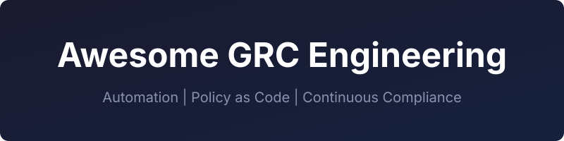

  

  

> Curated resources for GRC engineering: automation, policy as code, and continuous compliance

A curated list of tools, learning resources, frameworks, and community resources for GRC (Governance, Risk, and Compliance) engineering — bridging traditional business-focused GRC with technical implementation.

## Policy as Code

Policy as Code transforms compliance requirements into executable code that automatically enforces organizational rules across infrastructure, applications, and cloud environments. For GRC professionals, this enables continuous compliance verification instead of point-in-time audits. For engineers, it provides guardrails that prevent misconfigurations before deployment.

### OPA (Open Policy Agent)

General-purpose policy engine using Rego language to enforce decisions across Kubernetes, Terraform, APIs, and microservices. Essential for GRC engineers building unified compliance controls across heterogeneous infrastructure — one policy language, many enforcement points.

**Why it matters:** Domain-agnostic policy framework enabling centralized control definitions that execute wherever needed — from API authorization to infrastructure provisioning.

**Best for:** Organizations needing cross-platform policy consistency across their entire stack.

**Tags:** engineer-friendly

- [Official Site](https://www.openpolicyagent.org)
- [GitHub](https://github.com/open-policy-agent/opa)

### OPA Gatekeeper

Kubernetes admission controller built on OPA that enforces policies during resource creation and updates. Prevents non-compliant Kubernetes resources from being deployed by validating against constraint templates before admission.

**Why it matters:** Standard for Kubernetes policy enforcement with production-tested constraint framework, enabling shift-left compliance in cloud-native environments.

**Best for:** Kubernetes clusters requiring admission control and policy enforcement at the API level.

**Tags:** engineer-friendly

- [Official Site](https://open-policy-agent.github.io/gatekeeper/)
- [GitHub](https://github.com/open-policy-agent/gatekeeper)

### Kyverno

Kubernetes-native policy engine that validates, mutates, generates, and cleans up resources using YAML policies — no new programming language required. For GRC engineers, Kyverno provides shift-left compliance by preventing non-compliant Kubernetes resources from deployment, with policies that map directly to security controls.

**Why it matters:** CNCF Incubating project trusted by Spotify, LinkedIn, and US DoD. Unlike general-purpose policy engines, Kyverno speaks Kubernetes natively, making it accessible to platform engineers without policy language expertise.

**Best for:** Organizations running Kubernetes workloads needing policy enforcement without Rego learning curve.

**Tags:** both

- [Official Site](https://kyverno.io)
- [GitHub](https://github.com/kyverno/kyverno)
- [Policy Library](https://kyverno.io/policies/)

### HashiCorp Sentinel

Policy framework deeply integrated with HashiCorp ecosystem (Terraform, Vault, Nomad, Consul) that evaluates policies at plan and apply phases. Enables proactive governance by blocking non-compliant infrastructure changes before execution.

**Why it matters:** Shift-left governance for HashiCorp stack with first-class HCP Terraform integration, preventing costly post-deployment remediation.

**Best for:** Organizations heavily invested in HashiCorp ecosystem needing policy enforcement in IaC workflows.

**Tags:** engineer-friendly

- [Official Site](https://developer.hashicorp.com/sentinel)
- [Documentation](https://developer.hashicorp.com/terraform/cloud-docs/policy-enforcement)

### Cloud Custodian

Multi-cloud rules engine for AWS, Azure, and GCP that enforces security and cost policies through automated resource management. Defines organizational rules in YAML and executes them across cloud environments.

**Why it matters:** Unified policy enforcement across multiple clouds with both security compliance and cost optimization use cases, filling the gap between policy engines and cloud-native tooling.

**Best for:** Multi-cloud environments requiring automated resource governance and cost control.

**Tags:** both

- [Official Site](https://cloudcustodian.io)
- [GitHub](https://github.com/cloud-custodian/cloud-custodian)

## Security Scanners

Security scanners enable shift-left compliance by identifying misconfigurations, vulnerabilities, and policy violations before deployment. In GRC context, they generate automated evidence for continuous compliance and reduce audit burden by catching issues early. For engineers, they integrate into CI/CD pipelines to provide immediate feedback on security posture. Tools below are organized by workflow stage: pre-deployment scanning, unified multi-purpose scanners, and post-deployment auditing.

### Checkov

Infrastructure-as-Code static analyzer for Terraform, CloudFormation, Kubernetes manifests, ARM templates, Helm charts, and CDK. Scans configurations against 1000+ built-in policies and supports custom policy definitions using Python or YAML.

**Why it matters:** Pre-deployment IaC scanning prevents misconfigurations from reaching production, enabling policy-as-code enforcement with detailed remediation guidance.

**Best for:** Pre-deployment shift-left scanning for organizations practicing infrastructure-as-code.

**Tags:** engineer-friendly

- [Official Site](https://www.checkov.io)
- [GitHub](https://github.com/bridgecrewio/checkov)

### Semgrep

Static application security testing (SAST) tool that analyzes source code for security vulnerabilities, bugs, and coding standards violations. Supports 30+ languages with custom rule definition using semantic pattern matching.

**Why it matters:** Code-level security scanning integrated into developer workflows, catching vulnerabilities before they become production incidents.

**Best for:** Pre-deployment SAST for application security teams needing CI/CD integration with low false-positive rates.

**Tags:** engineer-friendly

- [Official Site](https://semgrep.dev)
- [GitHub](https://github.com/semgrep/semgrep)

### Trivy

Comprehensive security scanner covering containers, IaC, code repositories, Kubernetes, SBOM, and secrets detection. Consolidates multiple scanning needs into one tool with strong vulnerability database and SBOM integration.

**Why it matters:** Reduces toolchain complexity by unifying IaC, container, and SBOM scanning in a single tool. Successor to tfsec for IaC scanning, actively maintained by Aqua Security.

**Best for:** Unified scanning across infrastructure and application layers, suitable for pre-deployment and runtime use.

**Tags:** both

- [Official Site](https://trivy.dev)
- [GitHub](https://github.com/aquasecurity/trivy)

### Grype

Vulnerability scanner for container images, filesystems, and SBOM files. Pairs with Syft for SBOM generation and vulnerability analysis, with EPSS/KEV risk scoring and OpenVEX support.

**Why it matters:** Purpose-built for SBOM-based vulnerability scanning with risk prioritization, enabling evidence-based vulnerability management for compliance.

**Best for:** Organizations implementing SBOM-based vulnerability management workflows across development and runtime.

**Tags:** engineer-friendly

- [GitHub](https://github.com/anchore/grype)
- [Documentation](https://github.com/anchore/grype#getting-started)

### Prowler

Open-source cloud security platform that automates compliance scanning across AWS (584 checks), Azure (169 checks), GCP (89 checks), and Kubernetes (84 checks) against 40+ compliance frameworks including CIS, NIST 800, PCI-DSS, GDPR, and FedRAMP.

**Why it matters:** World's most widely used open-source cloud security tool providing automated evidence collection for cloud compliance audits, mapping technical findings to specific control requirements.

**Best for:** Post-deployment cloud security posture management with compliance framework mapping.

**Tags:** both

- [Official Site](https://prowler.com)
- [GitHub](https://github.com/prowler-cloud/prowler)

## GRC Platforms

Open-source GRC platforms provide centralized compliance management, risk tracking, and audit preparation capabilities — replacing spreadsheet-based processes with purpose-built tools. For GRC professionals, these platforms accelerate framework implementation with pre-mapped controls and audit workflows. For engineers, they provide APIs and automation capabilities for integrating compliance into existing toolchains.

### CISO Assistant

Lightweight open-source GRC platform with 30+ pre-mapped compliance frameworks (SOC2, GDPR, ISO 27001, PCI-DSS) designed for human-centric usability. Provides control mapping, risk assessment, and evidence management without enterprise-grade complexity.

**Why it matters:** Removes barriers to entry for small teams and first-time CISOs — get compliance framework implementation in hours instead of months without heavy process overhead.

**Best for:** Small to mid-size organizations starting their GRC journey or teams needing framework implementation without enterprise tooling costs.

**Tags:** both

- [Official Site](https://cisoa.org)
- [GitHub](https://github.com/intuitem/ciso-assistant-community)

### Eramba

Comprehensive open-source GRC platform covering risk management, compliance audits, policy management, and third-party risk. Mature platform with decade+ track record and ISO/PCI/SOC2-certified processes built by CISOs for CISOs.

**Why it matters:** Enterprise-grade audit readiness with process-heavy workflows designed for formal compliance programs — the open-source alternative to commercial GRC suites.

**Best for:** Organizations with established compliance programs needing comprehensive GRC platform capabilities and formal audit processes.

**Tags:** GRC-professional-friendly

- [Official Site](https://www.eramba.org)
- [GitHub](https://github.com/eramba/docker)

### GovReady-Q

Specialized GRC platform for DevSecOps environments with NIST OSCAL and OpenControl support. Automates compliance documentation generation and self-service assessment workflows optimized for federal and government use cases.

**Why it matters:** OSCAL-native platform accelerates authorization processes with machine-readable compliance formats, enabling continuous compliance in high-assurance environments.

**Best for:** Organizations pursuing FedRAMP, FISMA, or other government authorizations requiring OSCAL compliance artifacts.

**Tags:** engineer-friendly

- [GitHub](https://github.com/GovReady/govready-q)

### OpenGRC

Simple open-source cyber GRC platform focused on small business and team needs. Provides essential GRC capabilities — risk tracking, compliance documentation, control management — without enterprise complexity.

**Why it matters:** Pragmatic GRC tooling for teams not needing full enterprise features, filling the gap between spreadsheets and comprehensive platforms.

**Best for:** Small businesses and teams needing lightweight GRC management without learning curve or operational overhead.

**Tags:** both

- [Official Site](https://opengrc.com)
- [GitHub](https://github.com/LeeMangold/OpenGRC)

## Evidence Automation

Evidence automation transforms audit preparation from manual screenshot collection to continuous compliance data pipelines. For GRC professionals, these tools generate real-time compliance evidence, reducing audit prep from months to minutes. For engineers, they enable SBOM generation, vulnerability tracking, and audit logging that integrate directly into CI/CD workflows. The tools below span SBOM generation, audit logging, and full compliance platforms.

> **SBOM Format Guidance:** Use SPDX for license compliance and legal use cases (ISO-certified standard). Use CycloneDX for security-focused vulnerability management (includes VEX support). Syft supports both formats.

### Syft

SBOM generator that creates Software Bill of Materials from container images, filesystems, and source code. Supports SPDX and CycloneDX formats across 40+ packaging ecosystems (npm, Maven, pip, Go modules, etc.).

**Why it matters:** Foundation for vulnerability scanning and supply chain security, generating machine-readable software composition data required by executive order and compliance frameworks.

**Best for:** Organizations implementing SBOM requirements for containers and applications, feeding vulnerability scanners and compliance evidence systems.

**Tags:** engineer-friendly

- [Official Site](https://anchore.com/opensource/)
- [GitHub](https://github.com/anchore/syft)

### AWS CloudTrail

Native AWS audit logging service that records API calls and resource activity across your AWS account. Provides immutable audit trail for compliance evidence and security forensics.

**Why it matters:** Source of truth for "who did what when" in AWS environments — foundational for SOC2, ISO 27001, and regulatory compliance requiring access audit trails.

**Best for:** AWS users needing comprehensive API-level audit logging for compliance and security monitoring.

**Tags:** both

- [Official Site](https://aws.amazon.com/cloudtrail/)
- [Documentation](https://docs.aws.amazon.com/cloudtrail/)

### Cloud Custodian

Multi-cloud rules engine that enforces security and cost policies with automated remediation. Provides evidence of automated policy enforcement across AWS, Azure, and GCP. Also listed in Policy as Code section for policy enforcement use cases.

**Why it matters:** Continuous compliance through automated enforcement — generates evidence showing controls are actively running, not just documented.

**Best for:** Multi-cloud environments requiring automated policy enforcement with compliance evidence generation.

**Tags:** both

### Drata (Commercial)

Commercial compliance automation platform that collects real-time evidence from cloud infrastructure, codebases, HR systems, and security tools. Automates SOC2, ISO 27001, HIPAA, and GDPR audit preparation with continuous control monitoring.

**Why it matters:** Turnkey audit preparation reducing compliance overhead from months to minutes through automated evidence collection and control mapping.

**Best for:** Organizations pursuing multiple compliance certifications needing automated evidence collection without custom integration.

**Tags:** GRC-professional-friendly

- [Official Site](https://drata.com)

### Vanta (Commercial)

Commercial compliance platform providing continuous control monitoring and automated evidence collection. Integrates with cloud providers, SaaS applications, and security tools for real-time compliance posture.

**Why it matters:** Leading SaaS compliance platform with extensive integration ecosystem, enabling continuous assurance for SOC2, ISO 27001, HIPAA, and GDPR.

**Best for:** Fast-growing companies needing quick compliance certification with minimal compliance team overhead.

**Tags:** GRC-professional-friendly

- [Official Site](https://vanta.com)

**Open-source alternative note:** For open-source evidence automation, combine Syft (SBOM) + Grype (vulnerability scanning) + Cloud Custodian (policy enforcement) + CloudTrail/native audit logs with custom integration scripts. Commercial platforms (Drata/Vanta) provide turnkey integrations and compliance-specific workflows at the cost of vendor lock-in.

## Learning Resources

This section serves dual audiences: GRC professionals learning technical implementation skills and engineers learning compliance frameworks. Each resource includes audience labels (GRC→technical, technical→GRC, or both) and describes what you'll learn to help you find the right educational path.

### GRC Engineering Fundamentals

Foundational philosophy and principles for applying engineering practices to compliance and governance challenges.

- [GRC Engineering Manifesto](https://grc.engineering/#manifesto) - Core principles of treating compliance as engineering problems to solve. Learn the philosophy behind automation, continuous compliance, and replacing compliance theater with measurable outcomes. Essential reading for understanding the mindset shift from checkbox auditing to engineering-driven GRC.
- [GRC Engineering Learning Hub](https://grc.engineering/learning-hub) - Community-developed knowledge base with curated books, courses, podcasts, and blogs. Navigate from foundational concepts through hands-on implementation resources. Central starting point for both GRC professionals learning technical skills and engineers learning compliance frameworks.

### Books & Courses

Educational resources bridging GRC concepts with technical implementation, with audience labels to guide selection.

- [GRC Engineering for AWS](https://www.amazon.com/GRC-ENGINEERING-AWS-Hands-Engineering/dp/B0FDLZX4BP) - **Audience: Both** - Hands-on guidance for implementing governance, risk, and compliance engineering in AWS environments. Learn to translate SOC2, ISO 27001, and FedRAMP requirements into AWS services, infrastructure-as-code, and automated evidence pipelines. Written by LinkedIn Learning instructor AJ Yawn with 180K+ course completions.
- [How to Measure Anything in Cybersecurity Risk](https://www.amazon.com/How-Measure-Anything-Cybersecurity-Risk/dp/1119085292) - **Audience: Both** - Learn quantitative risk analysis using FAIR (Factor Analysis of Information Risk) methodology. For GRC professionals: move beyond qualitative heat maps to data-driven measurement. For engineers: translate security metrics into business risk language with statistical rigor. Foundational text for modern risk quantification.
- [Cybersecurity Foundations: GRC by AJ Yawn](https://www.linkedin.com/learning/cybersecurity-foundations-governance-risk-and-compliance-grc) - **Audience: technical→GRC** - LinkedIn Learning course teaching foundational GRC concepts (SOC2, ISO 27001, NIST frameworks) for engineers. Learn how engineering teams contribute to compliance programs and why certain controls exist from business perspective.
- [GRC Training Courses by Ayoub Fandi](https://www.linkedin.com/learning/instructors/ayoub-fandi) - **Audience: Both** - LinkedIn Learning courses covering GRC implementation patterns, risk management frameworks, and bridging compliance with platform engineering teams. Practical focus on real-world implementation challenges.

### Blogs & Newsletters

Practitioner-driven content covering GRC engineering implementation, automation patterns, and real-world case studies.

- [The GRC Engineer Newsletter](https://grcengineer.com/) - Ayoub Fandi's newsletter featuring practitioner stories from Netflix, Zoom, IKEA, and other organizations implementing GRC engineering principles. Learn from peer implementations, automation strategies, and how leading GRC teams collaborate with platform engineering. 40 posts in 2025 with 67,500 words of content covering frameworks, real-world challenges, and hands-on case studies.
- [blog.grc.engineering](https://blog.grc.engineering/) - Implementation guides and case studies for GRC automation and continuous compliance. Learn about SOC2 continuous assurance (ALCOVE framework), framework automation trends, and GRC's evolution into platform engineering collaboration. Practitioner-focused content moving GRC from theory to engineering practice.
- [Cloud Security Guy on GRC Engineering](https://cloudsecurityguy.substack.com/) - Substack newsletter covering why GRC engineering is the future of compliance, bridging cloud security and governance practices. Learn how security engineering and compliance converge in cloud-native environments.

### Podcasts & Videos

Audio and video content covering GRC business context, leadership perspective, and practitioner insights.

- [Security & Compliance Weekly](https://securityweekly.com/category-shows/security-compliance-weekly/) - Enterprise Security Weekly segment dedicated to security and compliance topics, featuring GRC leaders and practitioners. **Audience: Both** - Regular coverage of compliance automation, GRC platform trends, and how security engineering integrates with compliance programs.
- ISACA GRC Conference Sessions - Annual conference with 40+ expert-led sessions on GRC environment evolution, automation, and emerging technologies. **Audience: GRC professionals** - See Conferences & Events section for event details and registration.

## Frameworks

Engineering-focused resources for implementing compliance frameworks through automation, continuous monitoring, and machine-readable formats — not policy templates or audit checklists. These guides help engineers translate compliance requirements into infrastructure-as-code, automated evidence pipelines, and continuous assurance architectures.

### SOC 2

SOC 2 compliance has evolved from annual point-in-time audits to continuous control monitoring with real-time dashboards. Modern SOC 2 engineering focuses on automated evidence collection, continuous assurance, and integrating compliance into existing engineering workflows rather than manual screenshot gathering.

**Engineering value:** Shift from audit prep as a painful annual event to compliance as an ongoing engineering practice. Automated control monitoring reduces audit burden while providing year-round visibility into security posture.

- [SOC 2 is dead, long live SOC 2!](https://blog.grc.engineering/p/soc-2-is-dead-long-live-soc-2) - Learn the ALCOVE framework for continuous SOC 2 assurance: Automated control monitoring, continuous evidence collection, and real-time compliance visibility. Practitioner guide to modernizing SOC 2 from point-in-time to continuous.
- CISO Assistant - Open-source GRC platform with pre-mapped SOC 2 controls and risk assessment workflows. See GRC Platforms section for full entry.
- [The Complete Guide to SOC 2 Automation](https://www.workstreet.com/blog/soc-2-automation) - Platform-agnostic automation patterns: evidence collection pipelines, continuous monitoring architectures, and control mapping to infrastructure.

### ISO 27001

ISO 27001 implementation automation focuses on reducing the 75% manual effort traditionally spent on evidence collection and control documentation. Modern approaches integrate with existing toolchains (JIRA, Terraform, CI/CD) to automate evidence gathering, enable multi-framework efficiency (reusing evidence across SOC 2 and ISO 27001), and implement quarterly automated control reviews.

**Engineering value:** Translate ISO 27001 Annex A controls into cloud infrastructure policies, automate compliance evidence collection from existing tools, and maintain continuous ISMS (Information Security Management System) compliance without manual documentation overhead.

- [A Quick-Start Guide To ISO 27001 Compliance Automation](https://sprinto.com/blog/iso-27001-automation-guide/) - Learn to automate ISO 27001 implementation: mapping controls to cloud infrastructure, building evidence collection pipelines, and integrating compliance into engineering workflows.
- [Automating ISO 27001 and SOC 2 Evidence Collection](https://www.surecloud.com/blog-hub/automating-iso-27001-and-soc-2-evidence-collection-in-2026) - Multi-framework automation patterns enabling evidence reuse across ISO 27001 and SOC 2, reducing redundant effort and maintaining consistency across compliance programs.
- CISO Assistant - Pre-mapped ISO 27001 controls in open-source GRC platform. See GRC Platforms section for full entry.

### NIST (OSCAL, CSF, 800-53)

NIST's Open Security Controls Assessment Language (OSCAL) is the machine-readable standard for compliance automation, transforming security controls from text documents into XML, JSON, and YAML formats. OSCAL enables automated validation, continuous compliance monitoring, and reduces audit preparation from months to weeks.

**Engineering value:** Convert paper-based compliance artifacts into machine-readable formats that integrate with CI/CD pipelines, security tools, and GRC platforms. Automated validation catches errors early, interoperable formats enable tool ecosystem integration, and standardized structures reduce human error in control documentation.

**Official OSCAL Resources:**

- [OSCAL Project](https://pages.nist.gov/OSCAL/) - Official NIST documentation, getting started guides, and learning materials for the Open Security Controls Assessment Language.
- [GitHub: usnistgov/OSCAL](https://github.com/usnistgov/OSCAL) - OSCAL models, schemas, validation tools, and developer resources. Core repository for implementing OSCAL in security automation workflows.
- [GitHub: usnistgov/oscal-content](https://github.com/usnistgov/oscal-content) - NIST SP 800-53 Rev 5 security control catalog and baselines in OSCAL formats (XML/JSON/YAML). Official machine-readable versions of federal security controls.
- [CSWP 53: Charting the Course for NIST OSCAL](https://csrc.nist.gov/pubs/cswp/53/charting-the-course-for-nist-oscal/ipd) - NIST's strategic roadmap (December 2025) for OSCAL's future, including AI agent integration, digital twins for security modeling, and autonomous risk reasoning capabilities.

**Key OSCAL capabilities:** Machine-readable security control catalogs, automated validation and format conversion, integration with GRC platforms and security tools, community-maintained tool ecosystem.

### FedRAMP

FedRAMP (Federal Risk and Authorization Management Program) mandates OSCAL for all authorization packages by July 2026. The official FedRAMP automation repository provides pre-populated templates for System Security Plans (SSP), Security Assessment Plans (SAP), Security Assessment Reports (SAR), and Plan of Action & Milestones (POA&M) in machine-readable formats.

**Engineering value:** Eliminate months of manual documentation effort with pre-validated OSCAL templates. Machine-readable formats enable automated compliance checking, reduce authorization timeline, and ensure consistency with federal requirements. Templates include FedRAMP-specific extensions and conformity tags.

**Official FedRAMP OSCAL Resources:**

- [GitHub: GSA/fedramp-automation](https://github.com/GSA/fedramp-automation) - Official FedRAMP OSCAL templates in XML, JSON, and YAML formats. Includes System Security Plans, Security Assessment Plans/Reports, and POA&M templates with FedRAMP extensions.
- [FedRAMP OSCAL Templates](https://github.com/GSA/fedramp-automation/tree/master/src/content/rev5/templates) - Official FedRAMP OSCAL templates including System Security Plans, POA&M, SAP, and SAR in XML, JSON, and YAML formats.
- [OSCAL and FedRAMP Automation Guide](https://www.ignyteplatform.com/blog/fedramp/oscal-and-fedramp-automation/) - Implementation guidance for July 2026 OSCAL mandate: converting existing documentation, validation workflows, and automation strategies.
- GovReady-Q - OSCAL-native GRC platform for federal authorizations. See GRC Platforms section for full entry.

**July 2026 mandate context:** Federal agencies and cloud service providers must submit all FedRAMP authorization packages in OSCAL format after July 2026. Early adoption accelerates authorization timelines and positions organizations for continuous compliance monitoring.

## Community

### Communities & Forums

Active communities for GRC engineering practitioners:

- [GRC, Audit and Compliance Discord](https://discord.com/invite/Hum7WDGWEW) - Text and voice chat for GRC, audit, and compliance topics with channels for InfoSec, IT Audit, and Risk Management. Active community for real-time discussion and peer support.

- [SAHL GRC Community](https://www.linkedin.com/company/getsahl/) - Compliance professionals discussing automation, continuous controls monitoring, and GRC-as-code patterns. Community launched 2025 focused on modern compliance approaches.

### Conferences & Events

Annual conferences with GRC engineering relevance:

- [ISACA GRC Conference](https://www.isaca.org/training-and-events/conferences/grc-conference) - Annual joint ISACA/IIA event (August timeframe) with 40+ expert sessions on governance, risk management, and control. Offers up to 28 CPE credits and covers both traditional GRC practices and emerging automation approaches.

- [#RISK Europe](https://www.grcworldforums.com/risk/risk-expo-europe) - Europe's leading Risk, GRC, Security & RegTech Expo held annually in London. Features 5 content stages covering GRC, InfoSec, third-party risk, and regulatory technology.

- [Compliance Week National](https://www.complianceweek.com/events) - Annual conference for 500+ compliance, ethics, legal, and audit professionals. Focus on regulatory compliance and ethics programs with networking opportunities across industries.

## Related Awesome Lists

Complementary curated lists for GRC engineering domains:

### Security & Compliance

- [Awesome Security](https://github.com/sbilly/awesome-security) - Comprehensive security tools, libraries, and resources across all security domains.
- [Awesome DevSecOps](https://github.com/TaptuIT/awesome-devsecops) - Security integrated into DevOps workflows and CI/CD pipelines.
- [Awesome Threat Intelligence](https://github.com/hslatman/awesome-threat-intelligence) - Threat intelligence resources for risk-informed decision making.

### Infrastructure & Automation

- [Awesome Terraform](https://github.com/shuaibiyy/awesome-terraform) - Infrastructure as Code tools and patterns using Terraform.
- [Awesome Kubernetes](https://github.com/ramitsurana/awesome-kubernetes) - Kubernetes resources including policy enforcement and governance.

<!-- notoc -->
## Contributing

Contributions welcome! Read the [contribution guidelines](contributing.md) first.
